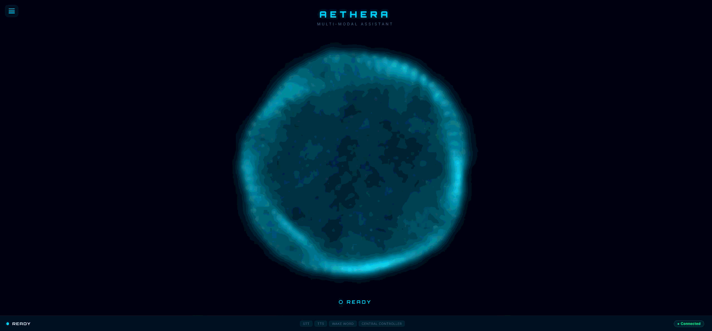
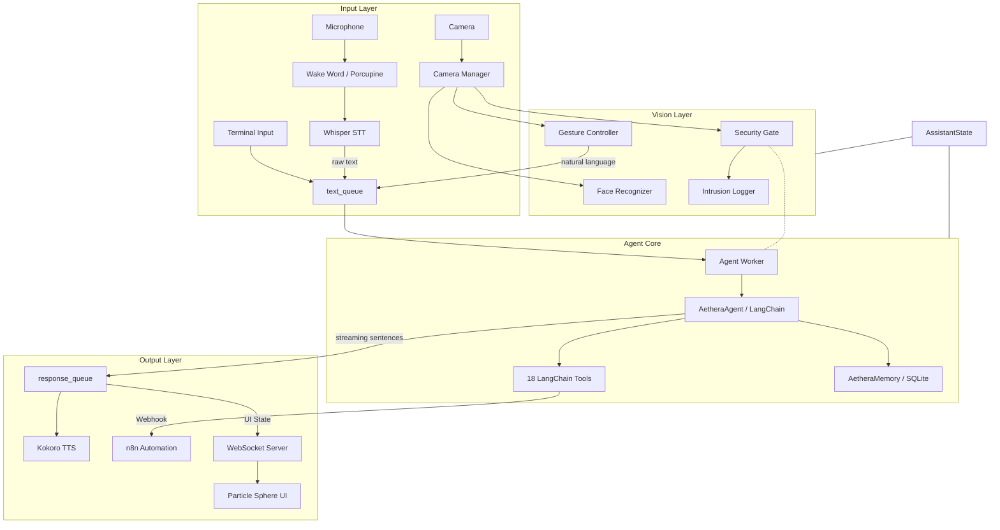

# Aethera: The Modular Multi-Modal Assistant

> [!CAUTION]
> **Project Under Development**: Aethera is in active development. Features are being added rapidly, and breaking changes may occur. This is an early preview.

> [!NOTE]
> **Agent-First Architecture**: Aethera now uses a unified LangChain agent as its single brain. Every utterance — voice or typed — flows through the LLM agent, which decides whether to converse naturally or invoke tools. No more regex intent matching.

**Aethera** is a premium multi-modal assistant merging local LLM intelligence with computer vision. Experience natural voice conversation with tool-calling, biometric face security with intrusion logging, and a 22-gesture library for touchless OS navigation. Reactive 3D visuals and n8n automation make it a powerful, privacy-first hub for modern Windows workflows.



---

## ✨ Key Features

### 🧠 Agent-First Conversational AI
- **Natural Conversation**: Powered by a LangChain agent (`qwen2.5:14b` via Ollama) — multi-turn context, reasoning, and natural responses.
- **18 Built-in Tools**: The agent decides when to call tools (open apps, control volume, search the web, etc.) through reasoning — not regex matching.
- **Streaming TTS**: Responses stream sentence-by-sentence to Kokoro TTS, reducing perceived latency.
- **Episodic & Profile Memory**: Persistent SQLite memory stores conversation history and user preferences across sessions.

### 🎙️ Advanced Voice System
- **Whisper STT**: High-accuracy, low-latency speech-to-text using Faster-Whisper (medium.en, CUDA).
- **Neural TTS**: Expressive text-to-speech via Kokoro with interruptible playback.
- **Wake Word Detection**: "Computer" keyword detection via Porcupine for hands-free activation.

### 👁️ Integrated Vision System
- **Biometric Security Gate**: Face recognition authenticates the owner and blocks unauthorized commands.
- **Automated Enrollment**: A guided 5-step process to learn your face during the first session.
- **Intrusion Protection**: Automatically logs and photographs unauthorized users, reporting attempts upon the owner's return.
- **22-Gesture Library**: Comprehensive MediaPipe-powered gesture control for full OS and media management.

### ⚙️ Automation & Control
- **n8n Integration**: Trigger complex multi-step workflows directly via voice or gesture.
- **OS Automation**: Direct control over Windows volume, applications, screenshots, window management.
- **Tool-Based Extensibility**: Add new capabilities by defining `@tool`-decorated functions in `tools/`.

### 🎨 Visual Experience
- **Particle Sphere Aura**: A speech-reactive 3D particle sphere that visualizes the assistant's state.
- **Modular Dashboard**: A crisp, functional React control panel for managing apps, macros, and vision settings.

---

## 🏗️ Architecture



---

## 🔧 Available Tools

The agent has access to 18 tools that it invokes by reasoning:

| Tool | Description |
| :--- | :--- |
| `open_app` | Launch any Windows application by name |
| `close_app` | Close an app (by name or the focused one) |
| `search_web` | Google search |
| `set_volume` / `increase_volume` / `decrease_volume` | Volume control |
| `mute_volume` / `unmute_volume` / `get_volume` | Mute/unmute/query |
| `get_weather` | Current weather via n8n |
| `check_email` | Email summary via n8n |
| `take_screenshot` | Screenshot (primary, all, or specific monitor) |
| `read_screen` | Describe screen content using SmolVLM |
| `system_health_check` | Check all module and service status |
| `move_window` | Move window between monitors |
| `trigger_n8n` | Trigger any n8n automation workflow |
| `remember_user_preference` | Store user preferences |
| `recall_user_preference` | Recall stored preferences |

---

## 🚀 Getting Started

### Prerequisites
- Python 3.10+
- [Ollama](https://ollama.ai/) with `qwen2.5:14b` installed.
- Windows 10/11.
- NVIDIA GPU with CUDA (recommended for Whisper + TTS + LLM).
- Webcam and Microphone.

### Installation
1. Clone the repository:
   ```bash
   git clone https://github.com/SanujaRubasinghe/Aethera-The-Modular-Multi-Modal-Assistant.git
   cd aethera/python-client
   ```
2. Install dependencies:
   ```bash
   pip install -r requirements.txt
   ```
3. Pull the LLM model:
   ```bash
   ollama pull qwen2.5:14b
   ```
4. Run the assistant:
   ```bash
   python -m assistant.voice_assistant
   ```

---

## 👤 FaceID Enrollment
On the first launch, Aethera will detect that no owner data exists and initiate a guided enrollment:
1. **Preparation**: You will be asked to look at the camera.
2. **Capture**: Aethera takes 5 photos to create a robust biometric profile.
3. **Processing**: Your profile is saved locally as an encrypted encoding (`face_data.pkl`).
4. **Active Protection**: Once enrolled, the "Security Gate" will greet you and allow access to commands only when you are present.

---

## 🖱️ Gesture Guide
Aethera supports 22+ gestures organized into 4 logical categories:

> [!IMPORTANT]
> **Work in Progress**: Gesture categories and mappings are currently being refined and are subject to change as the heuristic engine evolves.

| Category | Gestures | Action |
| :--- | :--- | :--- |
| **Assistant** | `open_palm`, `fist` | Wake / Stop Assistant |
| | `thumbs_up`, `thumbs_down` | Confirm (Yes) / Deny (No) |
| **Navigation** | `point`, `pinch`, `pinch_drag` | Move Cursor / Click / Drag |
| | `spread`, `pinch_close` | Zoom In / Zoom Out |
| **OS Control** | `swipe_left/right`, `l_shape` | Switch Desktop / Minimize |
| | `raise_the_roof`, `finger_gun` | Maximize / Open Start Menu |
| | `two_hand_scale` | Resize Window |
| **Media/System**| `swipe_up/down`, `victory` | Volume Control / Screenshot |
| | `rotate_cw/ccw`, `ok_sign` | Brightness Control / Mute |
| | `three_fingers` | Play / Pause Media |

---

## 🔒 Security & Privacy
- **Local Biometrics**: FaceID data and Hand tracking are processed 100% locally. No images are sent to the cloud.
- **Intrusion Reporting**: If an unauthorized person attempts to use Aethera, it logs the event, takes a photo, and safely locks Windows.
- **Audit Logs**: Access intrusion records and photos in `data/intrusions/` via the Modular Dashboard.

---

## 🛠️ Development
Adding a new tool is as simple as creating a `@tool`-decorated function:

```python
from langchain_core.tools import tool

@tool
def my_custom_tool(param: str) -> str:
    """Description of what this tool does — the agent reads this to decide when to call it."""
    # Your logic here
    return "Result message"
```

Add it to the `ALL_TOOLS` list in `tools/system_tools.py` and the agent will automatically have access to it.
