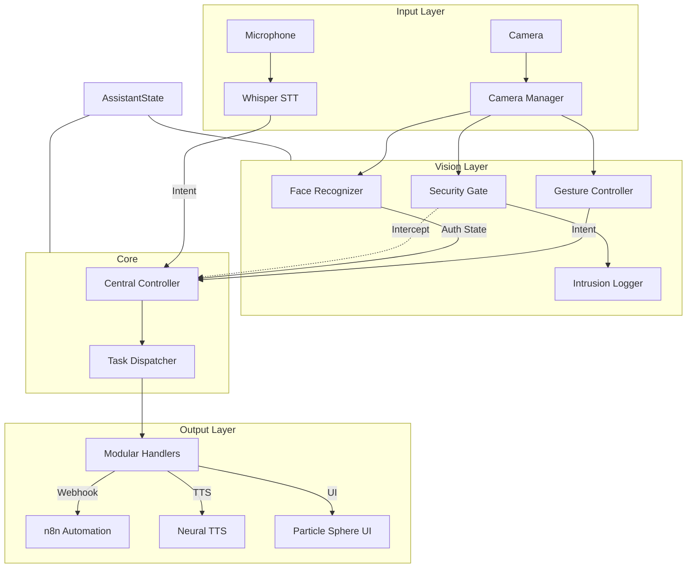

# Aethera: The Modular Multi-Modal Assistant

> [!CAUTION]
> **Project Under Development**: Aethera is in active development. Features are being added rapidly, and breaking changes may occur. This is an early preview.

> [!NOTE]
> **Vision Update**: Aethera's vision core (FaceID & Gesture Control) is now integrated and functional. Enrollment is automated on first run.

**Aethera** is a premium multi-modal assistant merging local LLM intelligence with computer vision. Experience advanced voice control, biometric face security with intrusion logging, and a 22-gesture library for touchless OS navigation. Reactive 3D visuals and n8n automation make it a powerful, privacy-first hub for modern Windows workflows.


---

## ✨ Key Features

### 🎙️ Advanced Voice System
- **Intelligent Intent Recognition**: Powered by local LLMs (Ollama/llama3) for natural language understanding.
- **Whisper STT**: High-accuracy, low-latency speech-to-text using Faster-Whisper.
- **Neural TTS**: Expressive text-to-speech with multiple backend support (Kokoro).
- **Proactive Context**: Real-time awareness of active applications and OS state.

### 👁️ Integrated Vision System
- **Biometric Security Gate**: Advanced face recognition that authenticates the owner and blocks unauthorized intents.
- **Automated Enrollment**: A guided 5-step process to learn your face during the first session.
- **Intrusion Protection**: Automatically logs and photographs unauthorized users, reporting attempts upon the owner's return.
- **22-Gesture Library**: Comprehensive MediaPipe-powered gesture control for full OS and media management.

### ⚙️ Automation & Control
- **n8n Integration**: Trigger complex multi-step workflows directly via voice or gesture.
- **OS Automation**: Direct control over Windows volume, brightness, and applications.
- **Plugin System**: Easily add new capabilities by dropping in new `BaseHandler` modules.

### 🎨 Visual Experience
- **Particle Sphere Aura**: A speech-reactive 3D particle sphere that visualizes the assistant's state.
- **Modular Dashboard**: A crisp, functional React control panel for managing apps, macros, and vision settings.

---

## 🏗️ Architecture



---

## 🚀 Getting Started

### Prerequisites
- Python 3.10+
- [Ollama](https://ollama.ai/) with `llama3` installed.
- Windows 10/11.
- Webcam and Microphone.

### Installation
1. Clone the repository:
   ```bash
   git clone https://github.com/SanujaRubasinghe/Aethera-The-Modular-Multi-Modal-Assistant.git
   cd aethera/python-client
   ```
2. Install dependencies:
   ```bash
   pip install -r requirements.txt
   ```
3. Set up `.env`:
   ```env
   N8N_WEBHOOK_URL=http://localhost:5678/webhook/voice-assistant
   OLLAMA_URL=http://localhost:11434/api/generate
   ```

---

## 👤 FaceID Enrollment
On the first launch, Aethera will detect that no owner data exists and initiate a guided enrollment:
1. **Preparation**: You will be asked to look at the camera.
2. **Capture**: Aethera takes 5 photos to create a robust biometric profile.
3. **Processing**: Your profile is saved locally as an encrypted encoding (`face_data.pkl`).
4. **Active Protection**: Once enrolled, the "Security Gate" will greet you and allow access to commands only when you are present.

---

## 🖱️ Gesture Guide
Aethera supports 22+ gestures organized into 4 logical categories:

> [!IMPORTANT]
> **Work in Progress**: Gesture categories and mappings are currently being refined and are subject to change as the heuristic engine evolves.

| Category | Gestures | Action |
| :--- | :--- | :--- |
| **Assistant** | `open_palm`, `fist` | Wake / Stop Assistant |
| | `thumbs_up`, `thumbs_down` | Confirm (Yes) / Deny (No) |
| **Navigation** | `point`, `pinch`, `pinch_drag` | Move Cursor / Click / Drag |
| | `spread`, `pinch_close` | Zoom In / Zoom Out |
| **OS Control** | `swipe_left/right`, `l_shape` | Switch Desktop / Minimize |
| | `raise_the_roof`, `finger_gun` | Maximize / Open Start Menu |
| | `two_hand_scale` | Resize Window |
| **Media/System**| `swipe_up/down`, `victory` | Volume Control / Screenshot |
| | `rotate_cw/ccw`, `ok_sign` | Brightness Control / Mute |
| | `three_fingers` | Play / Pause Media |

---

## 🔒 Security & Privacy
- **Local Biometrics**: FaceID data and Hand tracking are processed 100% locally. No images are sent to the cloud.
- **Intrusion Reporting**: If an unauthorized person attempts to use Aethera, it logs the event, takes a photo, and safely locks Windows.
- **Audit Logs**: Access intrusion records and photos in `data/intrusions/` via the Modular Dashboard.

---

## 🛠️ Development
Adding a new command is as simple as creating a new file in `handlers/`:

```python
from handlers.base_handler import BaseHandler

class MyNewHandler(BaseHandler):
    INTENT_NAME = "MY_CUSTOM_INTENT"
    
    def handle(self, intent, state, permission_manager):
        # Your logic here
        return TaskResult(True, "Command executed successfully!")
```
